# 📦 QyizyTales

**QyizyTales** — коммерческий проект для продажи и проведения уникальных авторских квизов в B2B-сегменте.

---

## 🎯 Проект по STAR

| | |
|---|---|
| **Situation** | У заказчика не было сайта для продажи квизов. Клиенты не могли посмотреть каталог, сравнить квизы и оставить заявку. Был только Telegram-канал. |
| **Task** | Разработать сайт с главной страницей-визиткой, каталогом квизов (категории → список → детальная страница) и формой отправки заявки. Бэкенд и админка уже есть — нужно интегрироваться с ними. |
| **Action** | Сверстал 8 блоков на главной (главный, кому подходит, этапы сотрудничества, слайдеры с популярными квизами, отзывами, тарифами, преимуществами). 
Настроил маршрутизацию для 3 уровней каталога. Интегрировал формы отправки заявок (обычные и авторские квизы) с бэкендом. 
Добавил хлебные крошки для навигации. 
Сделал адаптив под все устройства.. |
| **Result** |  Полноценный сайт с каталогом и формами заявок. Заявки уходят в бэкенд и админку. Клиенты могут найти квиз за 1-2 минуты. Сайт работает на ПК, планшетах и телефонах. |

---

## ✨ Ключевые особенности и решения

### 🔄 Работа с библиотекой Swiper
- Слайдер преимуществ с автопроигрыванием, бесконечный, адаптивный, прокрутка через колесо
- Слайдер популярных квизов с эффектом куба, кастомными кнопками
- Слайдер тарифов с настройками breakpoints, при достижении конца отматывается назад
- Слайдер отзывов вертикальный

### 📄 Нестандартные UI-элементы
- Кнопка с анимацией движущейся рамки
- Градиентная рамка для прозрачного фона

### ♾️ Работа с api
- Реализация подгрузки данных при скролле через `IntersectionObserver`
- Получение данных с бэкенда о квизах, категориях, тарифах, популярных квизов, отзывах
- отправка данных с формы

### 🎨 Работа с формой
- Разработан кастомный селект для формы
- Использование react-hook-form для валидации

### 🔍 Архитектура
- Модульная архитектура


---

## 🛠️ Технологический стек

| Категория | Технологии |
|-----------|------------|
| Фронтенд | React, TypeScript |
| Управление состоянием | Redux Toolkit |
| HTTP-запросы | Axios |
| Стилизация | CSS Modules |
| Работа с формой | React Hook Form |
| Архитектура | Модульная |
| Слайдеры | Swiper |

---

## 🚀 Локальный запуск проекта

```bash
git clone https://github.com/Alexey917/quizwebsite.git
cd quizwebsite/front
```

Запуск фронтенда

```bash
npm install && npm run dev
```

После запуска приложение будет доступно по адресу: http://localhost:5173 (или другому порту, который покажет Vite).

## 📸 Скриншоты

| Главная страница | Каталог | Детальная страница |
|:---:|:---:|:---:|
|  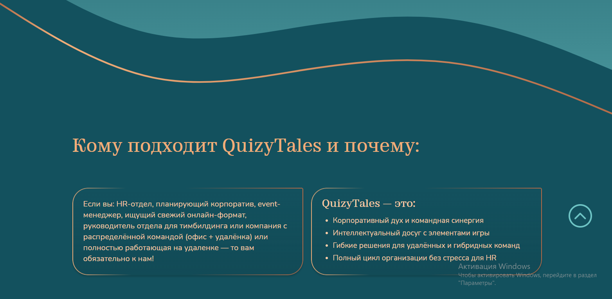  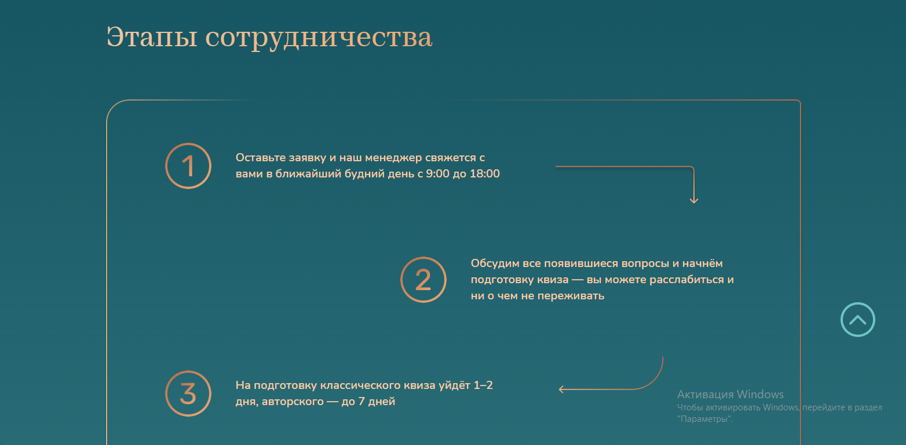 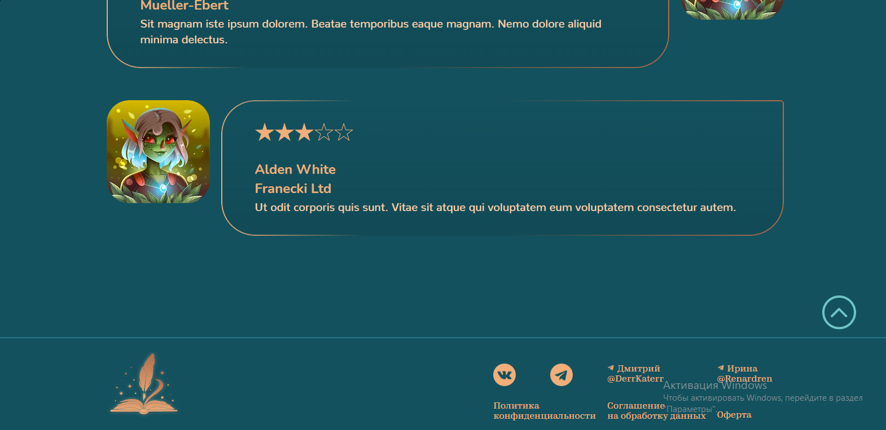 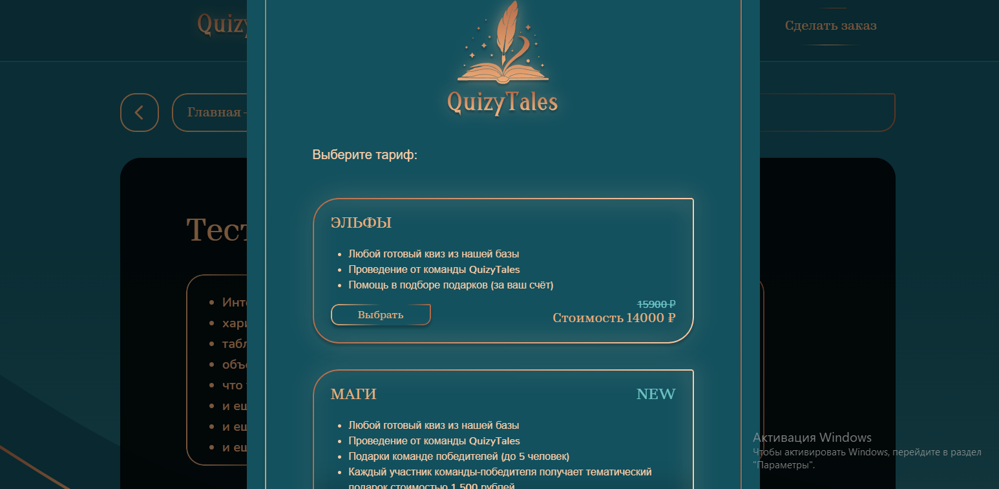 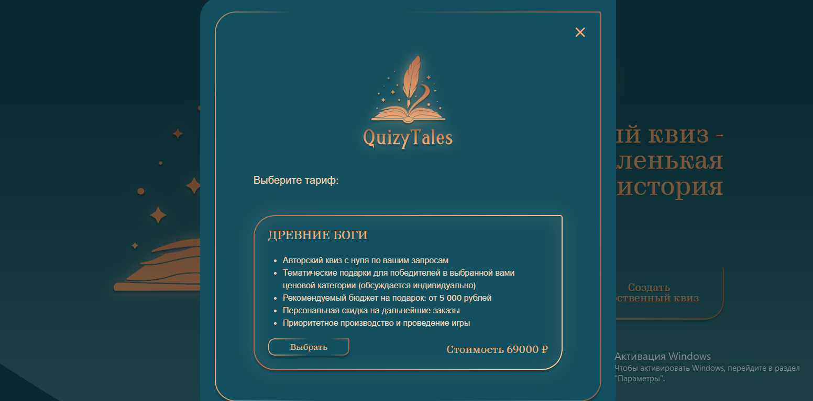 | 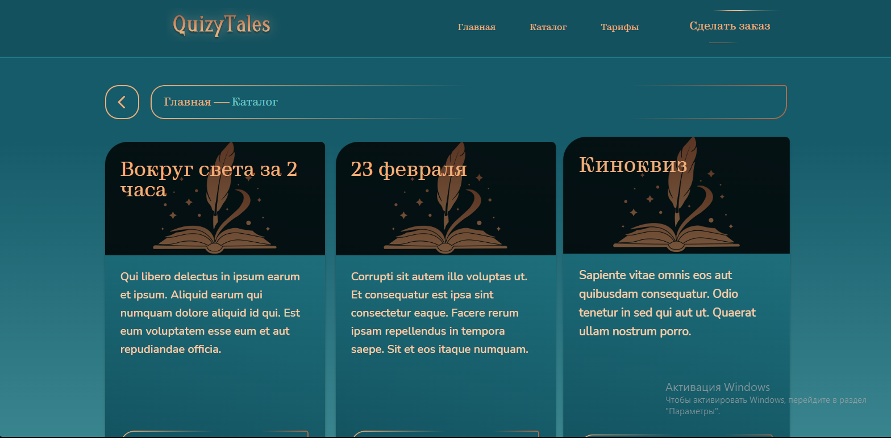 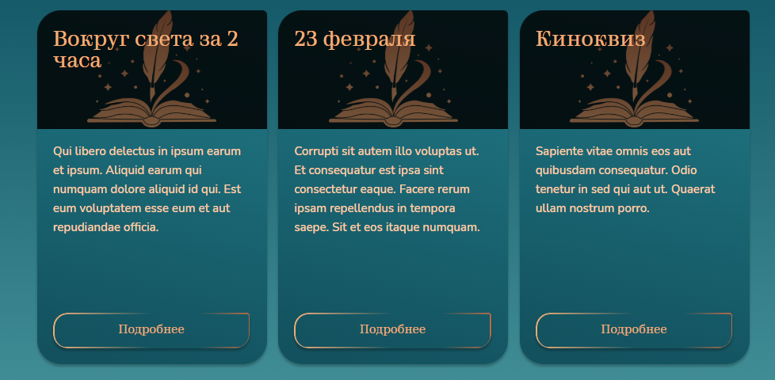 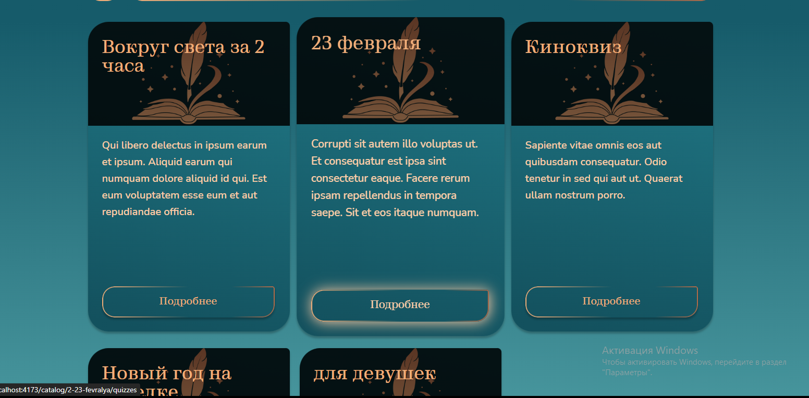 | 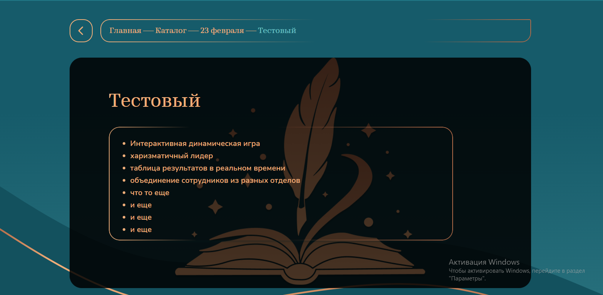 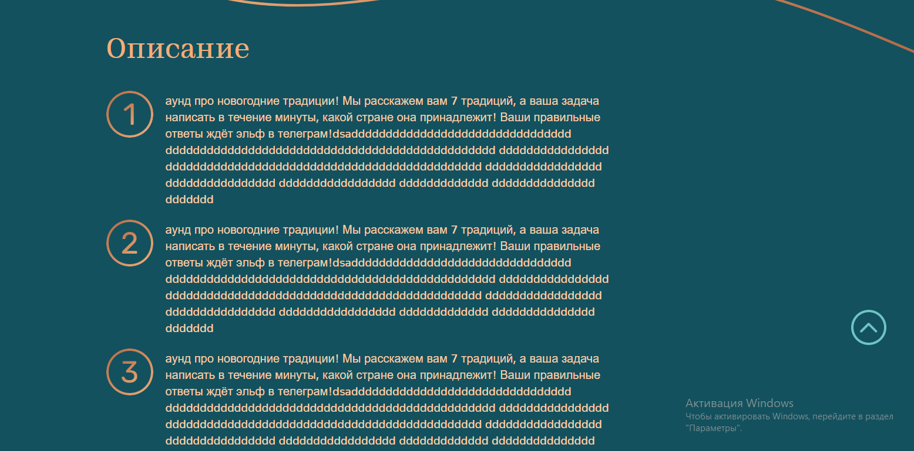 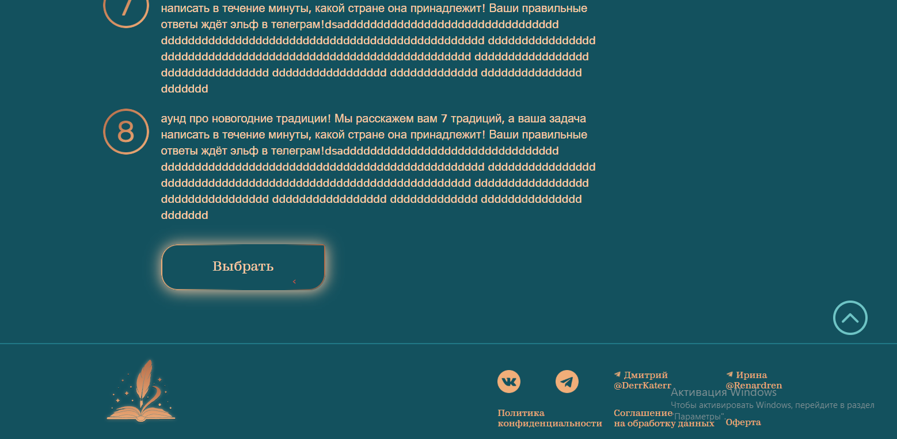

| Слайдеры | Форма заявки | Мобильная версия |
|:---:|:---:|:---:|
| 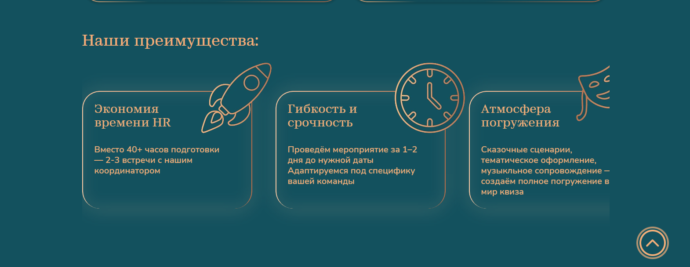 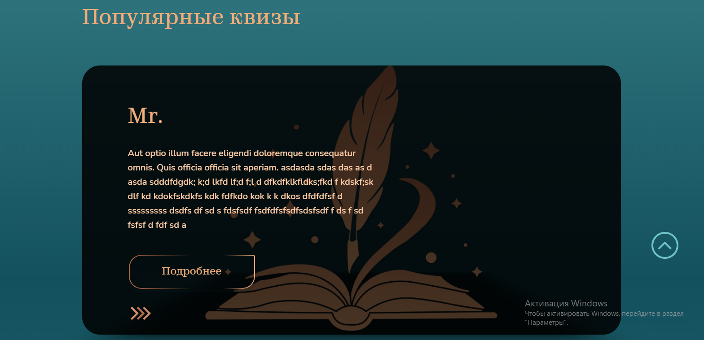 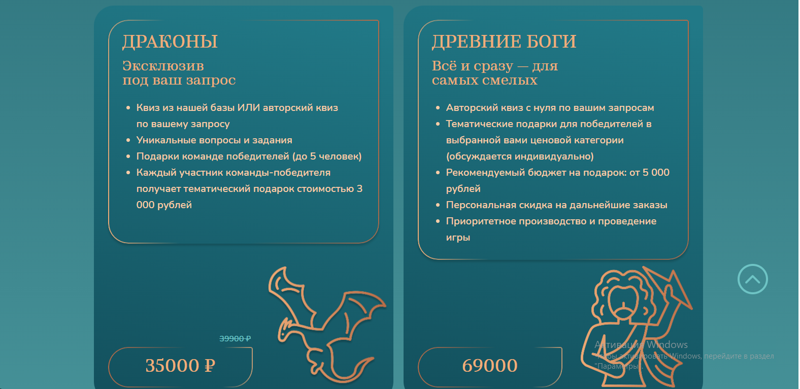 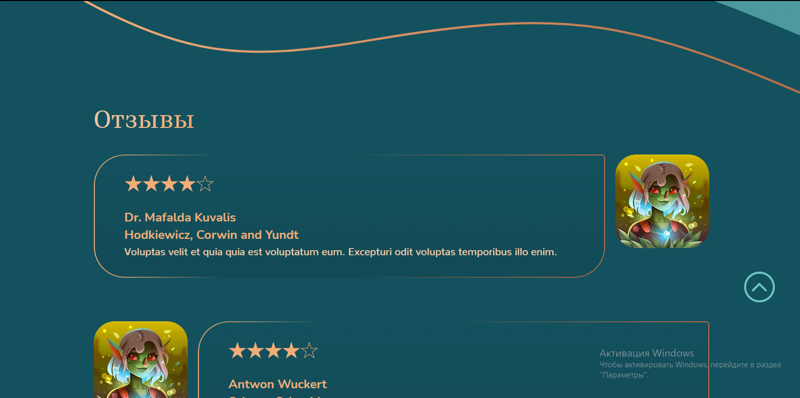 | 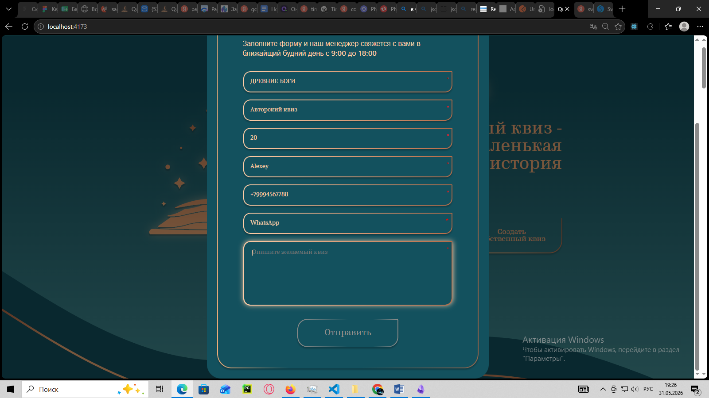 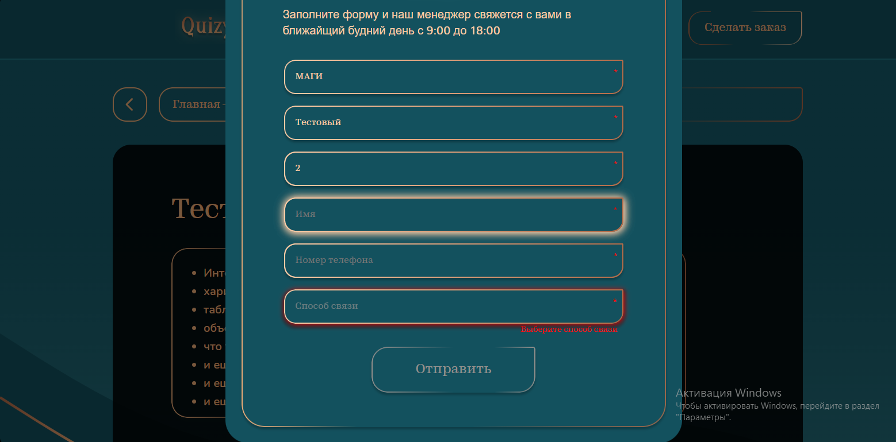 | 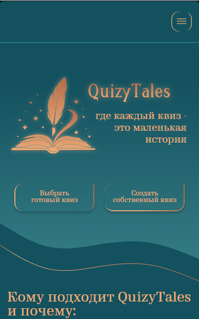 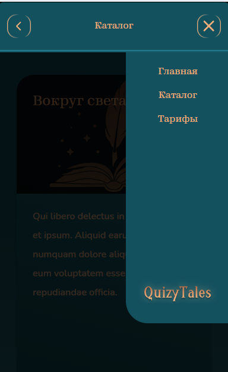 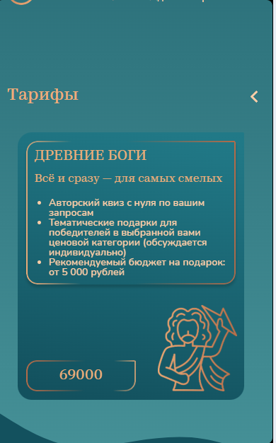 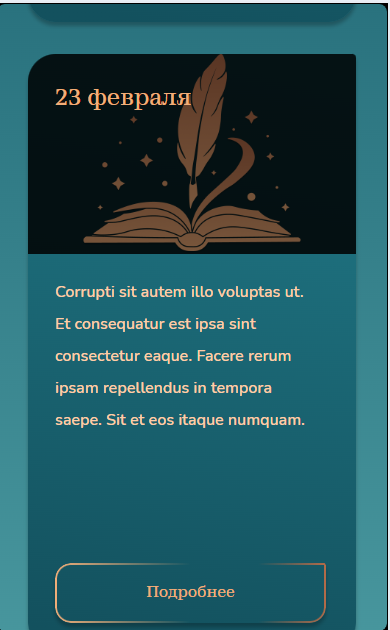 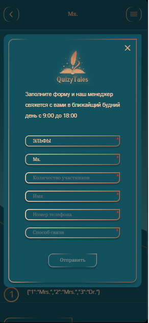


📬 Контакты
Связаться со мной можно через:

<a href="https://vk.com/id321802975">  </a> <a href="https://t.me/Alexey917">  </a>
